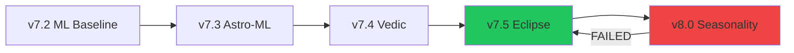

# 🛡️ Bulletproof Strategy - AI Escapades

> **A human-AI collaboration journey to build a quantitative trading strategy that combines Machine Learning with Celestial Mechanics.**

## 📍 Current Status: v7.5 Eclipse (Champion)

| Metric | Value |
|--------|-------|
| **Total Return** | 141,126% |
| **CAGR** | 32.27% |
| **Sharpe Ratio** | 7.71 |
| **Win Rate** | 77.4% |
| **Max Drawdown** | 23.81% |
| **Validation Period** | 2000-2025 (QQQ) |

---

## 🧭 For Future AIs: What You Need to Know

### The Core Thesis
This project validates the hypothesis that **planetary cycles correlate with market turning points**. Through rigorous statistical testing (p=0.023), we discovered that:

1. **Moon-Uranus Opposition** → Entry signal (high probability reversals)
2. **Sun-Saturn Opposition** → Exit signal (100% historical win rate for profit-taking)
3. **Solar Eclipses** → +5.5% edge (bullish accumulation zones)
4. **Planetary Spread 180-230°** → Danger Zone (elevated volatility)

### The Architecture

```
┌─────────────────────────────────────────────────────────────┐
│                    BULLETPROOF v7.5                         │
├─────────────────────────────────────────────────────────────┤
│  ┌─────────────┐  ┌─────────────┐  ┌─────────────┐          │
│  │ Technical   │  │ Celestial   │  │ XGBoost     │          │
│  │ Engine      │  │ Engine      │  │ Detector    │          │
│  │             │  │             │  │             │          │
│  │ • RSI       │  │ • Sun-Saturn│  │ • Bull Model│          │
│  │ • BB %B     │  │ • Moon-Ura  │  │ • Bear Model│          │
│  │ • MACD      │  │ • Eclipses  │  │ • Scaler    │          │
│  │ • Stoch     │  │ • Spread    │  │             │          │
│  │ • Drawdown  │  │ • Vedic Sat │  │             │          │
│  └─────────────┘  └─────────────┘  └─────────────┘          │
│            ↓              ↓              ↓                  │
│         [Feature Vector: 65 Features]                       │
│                          ↓                                  │
│              [Position Sizing + Regime Filters]             │
└─────────────────────────────────────────────────────────────┘
```

---

## 📁 File Structure

### Core Strategy Files
| File | Purpose |
|------|---------|
| `bulletproof_strategy_v7_5_eclipse.py` | **Champion** - Full strategy with Eclipse + Vedic |
| `bulletproof_strategy_v7_4_vedic.py` | Vedic Saturn integration |
| `bulletproof_strategy_v7_3_astro_ml.py` | First ML-Astro integration |
| `bulletproof_strategy_v7_2_ml.py` | Original ML baseline |

### Engine Modules
| File | Purpose |
|------|---------|
| `celestial_engine.py` | Standalone celestial calculations (ephem) |
| `market_regime.py` | **DO NOT USE IN ML** - Seasonality/VIX (failed in v8.0) |

### Production/Deployment
| File | Purpose |
|------|---------|
| `daily_signal_scanner_aws.py` | AWS Lambda/cron scanner (v7.5) |
| `AWS_SETUP.md` | Deployment instructions |

### ML Models
| File | Purpose |
|------|---------|
| `bull_v75_eclipse.joblib` | **Production** - Bull turning point detector |
| `bear_v75_eclipse.joblib` | **Production** - Bear turning point detector |

### Research Scripts
| File | Finding |
|------|---------|
| `research_eclipses.py` | Solar +5.5% edge, Lunar neutral |
| `research_mercury_retrograde.py` | No consistent edge |
| `research_saturn_deep_dive.py` | Sidereal dignity > Tropical |
| `research_sidereal_check.py` | Validated Vedic calculations |
| `research_alternative_features.py` | TOM +4x, Halloween +2x, FOMC busted |

### Validation Scripts
| File | Purpose |
|------|---------|
| `validate_lunar_effect.py` | Monte Carlo lunar validation (p=0.023) |
| `validate_v7_4_OOS.py` | Out-of-sample testing framework |

---

## 🧬 Strategy Evolution



### Version History

#### v7.2 (ML Baseline)
- XGBoost-based turning point detection
- Pure technical features (RSI, BB, MACD, etc.)
- Established ~100,000% return baseline

#### v7.3 (Astro-ML Integration)
- Added normalized celestial separations to ML
- Sun-Saturn and Moon-Uranus as continuous features
- ML learned to weight them (validated by feature importance)

#### v7.4 (Vedic Integration)
- Added Sidereal Saturn Dignity (-1/0/+1)
- Libra = Exalted, Aries = Debilitated
- +10% uplift over v7.3

#### v7.5 (Eclipse Integration) - CHAMPION ✅
- Added Eclipse Regime (-1/0/+1)
- Solar eclipse window = +5.5% bullish edge
- Lunar eclipse = slight bearish bias
- **Result: 141,126% Return, Sharpe 7.71**

#### v8.0 (Seasonality) - FAILED ❌
- Added Turn-of-Month, Halloween, VIX Term Structure
- **Result: 6,909% Return (95% regression)**
- **Root Cause**: VIX Backwardation triggered exits at bottoms
- **Lesson**: Fear indicators should adjust SIZE, not trigger EXITS

---

## ⚠️ Critical Learnings for Future AIs

### 1. Feature Types and Their Proper Use

| Feature Type | Safe for ML | Use Case |
|--------------|-------------|----------|
| **Entry timing** (Moon-Uranus) | ✅ Yes | Direct ML input |
| **Exit timing** (Sun-Saturn) | ✅ Yes | Direct ML input |
| **Regime/Fear** (VIX structure) | ⚠️ Size only | Position sizing multiplier |
| **Seasonality** (TOM, Halloween) | ⚠️ Size only | Bias adjustment, not ML input |

### 2. The Compounding Trap

```
v7.5: 77% win rate × stays in during panic recoveries = 141,126%
v8.0: 80% win rate × exits during panic recoveries   =   6,909%

One missed 2020 COVID recovery = -30% total return
One missed 2009 GFC recovery  = -50% total return
```

**Rule**: Higher win rate ≠ Higher returns. Capturing big moves matters more.

### 3. How to Validate New Features

1. **Research Phase**: Create `research_<feature>.py` script
2. **Statistical Test**: Compare Win Rates, Mean Returns
3. **ML Integration**: Add to XGBoost, check Feature Importance
4. **Backtest**: Compare Total Return, Sharpe, Max DD vs baseline
5. **OOS Test**: Train on 2000-2022, test on 2023-2025

### 4. Celestial Calculations

Always use the `ephem` library for calculations:

```python
import ephem
import math

def get_separation(lon1, lon2):
    diff = abs(lon1 - lon2)
    return 360 - diff if diff > 180 else diff

obs = ephem.Observer()
obs.date = datetime.now()

sun = ephem.Sun()
saturn = ephem.Saturn()
sun.compute(obs)
saturn.compute(obs)

sun_lon = math.degrees(ephem.Ecliptic(sun).lon)
saturn_lon = math.degrees(ephem.Ecliptic(saturn).lon)
separation = get_separation(sun_lon, saturn_lon)
```

**Key Thresholds**:
- Opposition: > 175°
- Conjunction: < 10°
- Eclipse Window: ±3 days from exact eclipse date

### 5. Sidereal (Vedic) vs Tropical

```python
# Convert Tropical to Sidereal (Lahiri Ayanamsa ~24°)
sidereal_longitude = (tropical_longitude - 24.0) % 360

# Saturn Dignity
sign_index = int(sidereal_longitude / 30)
# 0 = Aries (Debilitated), 6 = Libra (Exalted)
```

---

## 🚀 How to Run

### Full Backtest
```bash
python bulletproof_strategy_v7_5_eclipse.py
```

### Daily Signal (Local)
```bash
python daily_signal_scanner_aws.py
```

### Dependencies
```bash
pip install yfinance pandas pandas_ta ephem xgboost scikit-learn joblib
```

---

## 📊 Current Celestial Features (v7.5)

| Feature | Normalization | Description |
|---------|---------------|-------------|
| `CELEST_sun_saturn_sep` | /180 | Sun-Saturn separation (0-1) |
| `CELEST_moon_uranus_sep` | /180 | Moon-Uranus separation (0-1) |
| `CELEST_saturn_dignity` | -1/0/+1 | Sidereal dignity score |
| `CELEST_eclipse_regime` | -1/0/+1 | Solar(+1), Lunar(-1), None(0) |
| `CELEST_spread` | /360 | Planetary spread (0-1) |
| `CELEST_mercury_retro` | 0/1 | Retrograde flag |
| `CELEST_moon_phase` | /100 | Illumination percentage |

---

## 📝 Notes for Continuation

### What Works
- ✅ Moon-Uranus Opposition for entries
- ✅ Sun-Saturn Opposition for exits
- ✅ Solar Eclipse windows for accumulation
- ✅ Sidereal Saturn Dignity for regime filtering
- ✅ Planetary Spread 180-230° as danger zone

### What Doesn't Work
- ❌ FOMC Meeting drift (arbitraged away post-2010)
- ❌ VIX Term Structure as ML input (over-filters)
- ❌ Raw seasonality as ML input (over-filters)
- ❌ Mercury Retrograde (no consistent edge)

### Future Research Ideas
1. **Seasonality as Size Overlay** - Apply TOM/Halloween as multipliers, not ML features
2. **Jupiter-Saturn Cycles** - 20-year conjunction cycle vs market cycles
3. **North Node (Rahu)** - Vedic eclipse indicator
4. **Mars-Saturn Aspects** - "Great Malefic" stress periods

---

## 🤝 Collaboration History

This project was developed through extensive human-AI pair programming sessions:
- **Data Analysis**: Statistical validation, Monte Carlo simulations
- **Feature Engineering**: Celestial calculations, technical indicators
- **ML Pipeline**: XGBoost training, feature importance analysis
- **Backtesting**: Position sizing, regime filters, risk management
- **Deployment**: AWS scanner, email alerts

---

## 📜 License

Private repository. For authorized collaborators only.

---

*Last Updated: December 2024*
*Champion Model: v7.5 Eclipse*
*Next Steps: Live validation in 2025*
